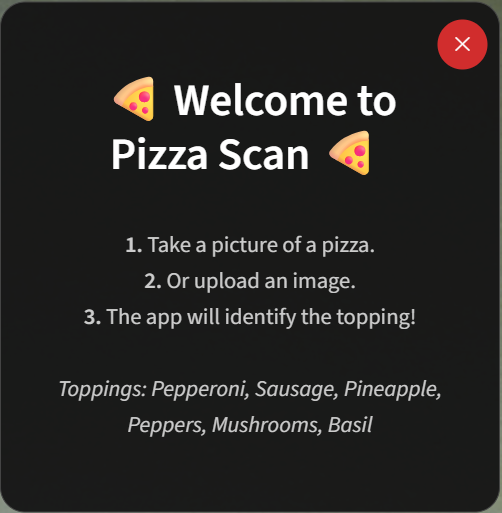
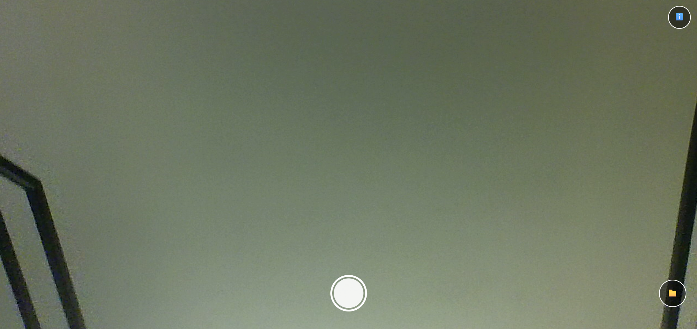
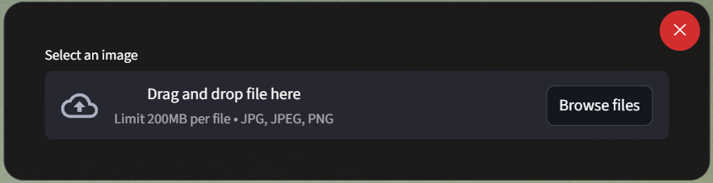
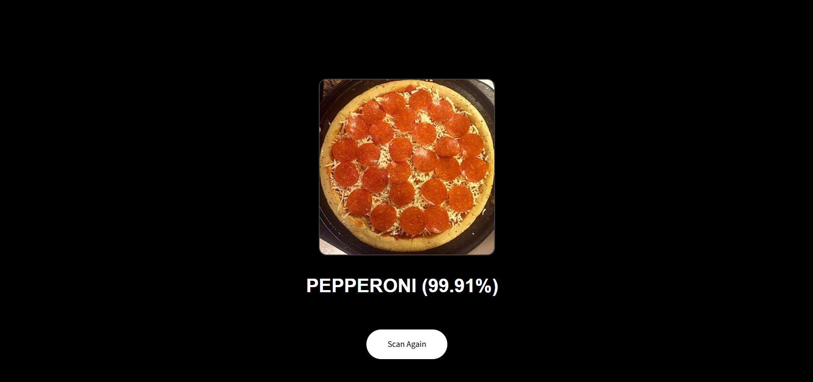

# Pizza Scan

## Description

Pizza Scan is an interactive computer vision web app that identifies six pizza toppings. This experiment involved using a **PyTorch model (ResNet 18)** and **transfer learning** to enable the model to identify different pizza toppings (chosen for fun). The model can identify pizzas with high confidence (80%+) through a **Streamlit webapp** with camera and upload functionalities. Through the programming process, I learned the basics of training and fine-tuning a model using PyTorch, cross-validation, managing Streamlit session states, and customizing CSS to override Streamlit elements.

## Installation

1. Clone the repository `git clone https://github.com/jasonlangchen/pizza-scan.git`
2. Install dependencies `pip install -r requirements.txt`
3. Launch the webapp through Streamlit `streamlit run pizza_app.py`

## Usages

**📸 Camera/Upload Mode**

Once the app has begun running in your browser (usually at `http://localhost:8501`), the following steps will show you the full capabilities of the web-app.
1. Allow the browser permission to access your webcam.
2. Follow the info pop-up instructions.

3. Click the camera button to take a photo.

5. Or upload an image.

6. View results with label and confidence.

**🛠 Training**

The repository contains a pre-trained model `best_model.pth`. If you wish to retrain the model with your own dataset, organize your data in subfolders `dataset/PIZZA_TOPPING`. Adjust `CLASS_NAMES` in the various files to match your subfolders and run `python train.py`. This will generate a new `best_model.pth` in your directory.

## Credits

* **PyTorch & Torchvision:** Used for the ResNet18 model architecture and pre-trained weights.
    * *Reference:* He, K., Zhang, X., Ren, S., & Sun, J. (2016). Deep residual learning for image recognition.
* **Dataset:** Original dataset captured by Jason Chen.

## License

Distributed under the MIT License. See `LICENSE` for more information.
